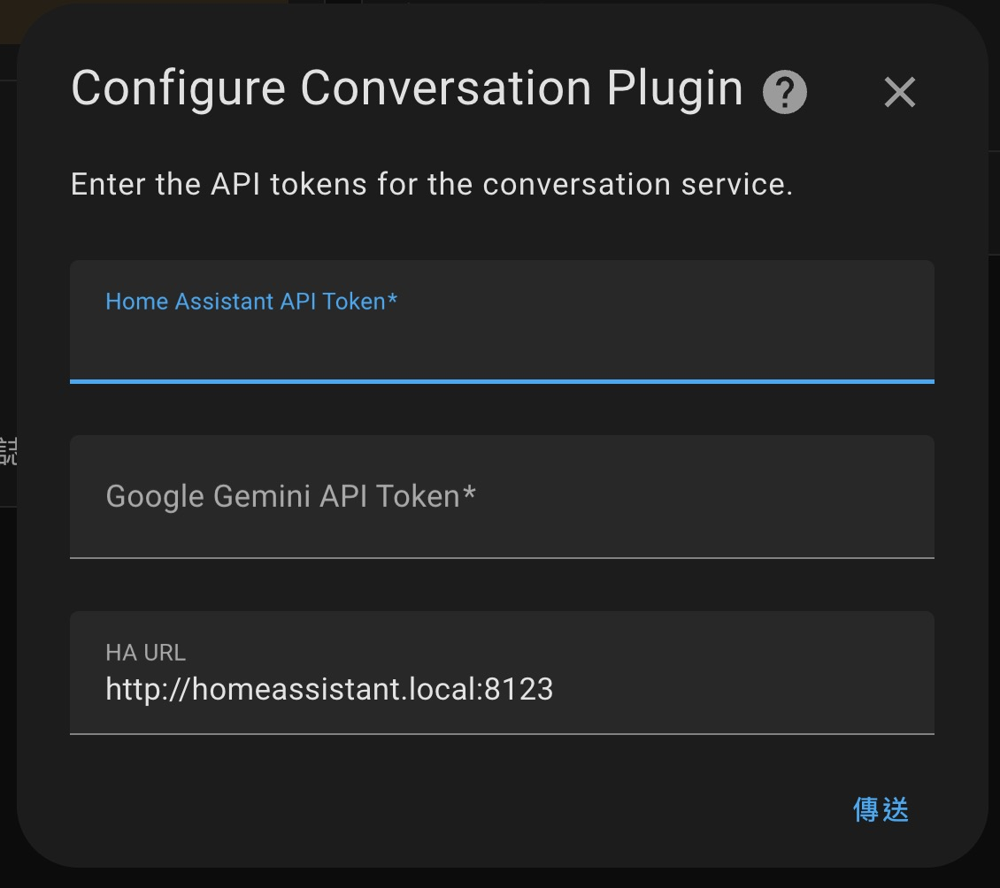

# Voice Control Over Google Gemini LLM

Voice Control Over Google Gemini LLM is a free add-on for Home Assistant that allows you to control devices using Google Gemini's language model.

## Configuration

1. **Google Gemini Token**: Enter your Google Gemini API token. You can apply for one [here](https://aistudio.google.com/app/apikey).
2. **Home Assistant Token**: Enter your Home Assistant token. You can find it under **Your Profile** -> **Security** -> **Refresh Token**. For more details, refer to the [Authentication Page](https://www.home-assistant.io/docs/authentication/).

   

3. **Integrate with Home Assistant**: Configure the add-on to work with your Home Assistant conversation agent.
